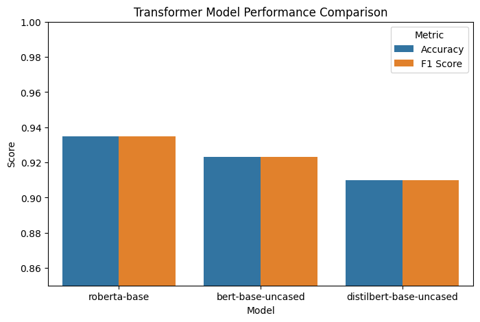

# Sentiment Analysis with Transformers

Fine-tuning and benchmarking BERT, DistilBERT, and RoBERTa for binary sentiment classification on Amazon product reviews.

## Overview

This project fine-tunes three transformer architectures on the Amazon Polarity dataset and compares their performance under identical training conditions.

**Task:** Binary sentiment classification — Negative (0) vs Positive (1)  
**Dataset:** Amazon Polarity (5,000 train / 1,000 test)  
**Best Model:** RoBERTa — 93.5% accuracy

## Results

| Model | Accuracy | F1 Score |
|-------|----------|----------|
| RoBERTa | **0.935** | **0.935** |
| BERT | 0.923 | 0.923 |
| DistilBERT | 0.910 | 0.910 |

## Pipeline

1. **Load** — Amazon Polarity dataset from Hugging Face
2. **Explore** — class distribution, sample reviews
3. **Preprocess** — remove HTML, URLs, normalize whitespace
4. **Tokenize** — convert text to token IDs (max_length=256)
5. **Fine-tune** — 3 models, identical training conditions
6. **Evaluate** — accuracy, F1, confusion matrix, error analysis
7. **Compare** — benchmark results across all models

## Training Configuration

```python
num_train_epochs = 4
learning_rate    = 2e-5
max_length       = 256
weight_decay     = 0.01
warmup_steps     = 100
early_stopping_patience = 2
```

## Stack

| Tool | Purpose |
|------|---------|
| Hugging Face Transformers | Model loading and fine-tuning |
| Hugging Face Datasets | Dataset loading |
| PyTorch | Training backend |
| scikit-learn | Evaluation metrics |
| Matplotlib / Seaborn | Visualization |

## Setup

1. Clone the repo
```bash
git clone https://github.com/Busrara/sentiment-analysis-transformers.git
cd sentiment-analysis-transformers
```

2. Install dependencies
```bash
pip install -r requirements.txt
```

3. Open `sentiment_analysis.ipynb` in Google Colab or Jupyter and run cells in order.

> **Note:** GPU recommended. Connect via Runtime → Change runtime type → T4 GPU in Colab.

## Key Findings

- **RoBERTa** outperforms BERT and DistilBERT on this task, consistent with its improved pretraining strategy.
- **DistilBERT** achieves competitive results at significantly lower computational cost.
- Common failure modes include mixed sentiment, sarcasm, and label noise in the dataset.
- Early stopping prevented overfitting across all three models.

## Performance



## Error Analysis

Out of 1,000 test reviews, RoBERTa misclassified **65**. Most errors involve:
- Reviews with both positive and negative statements
- Sarcastic phrasing
- Very short or ambiguous reviews
